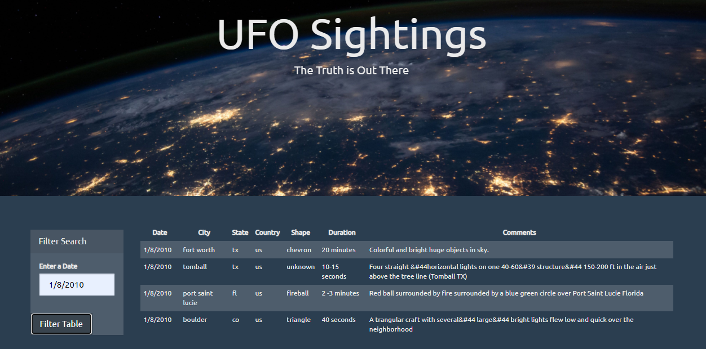
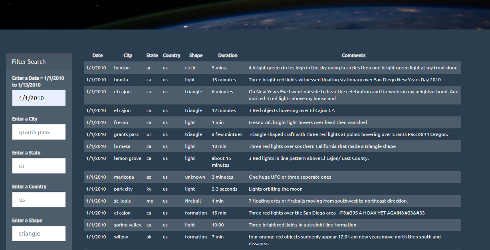
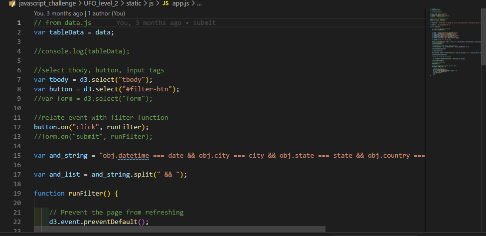
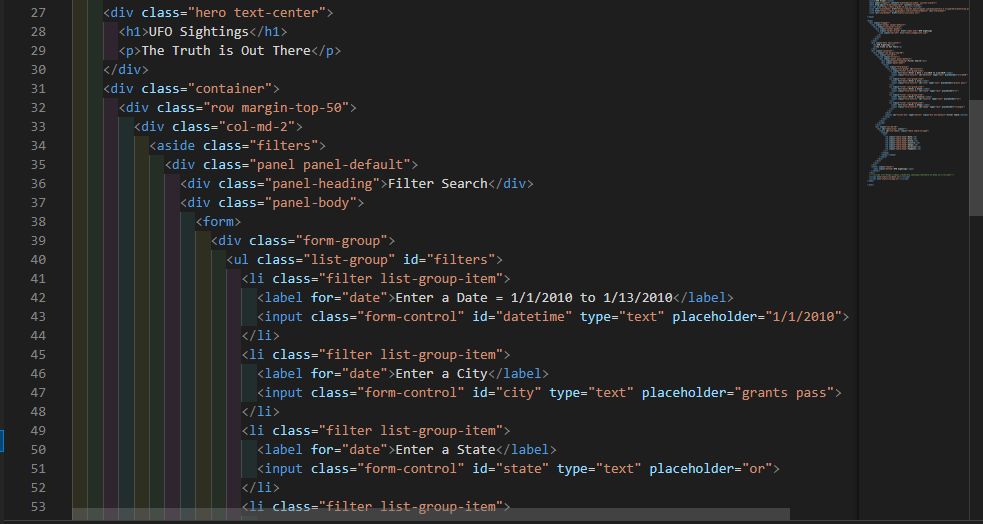

# JavaScript Project - JavaScript and DOM Manipulation

Tony Zhao finished 22/03/2021 

* Details as follows:

### Level 1: Automatic Table and Date Search

#### Screenshot Level 1:

* Create a basic HTML web page.

* Using the UFO dataset provided in the form of an array of JavaScript objects, write code that appends a table to the web page and then adds new rows of data for each UFO sighting.

* Make sure to have a column for `date/time`, `city`, `state`, `country`, `shape`, and `comment` at the very least.

* Use a date form in the HTML document and write JavaScript code that will listen for events and search through the `date/time` column to find rows that match user input.

_ _ _

### Level 2: Multiple Search Categories

#### Screenshot Level 2:

* Using multiple `input` tags and/or select dropdowns, write JavaScript code so the user can to set multiple filters and search for UFO sightings using the following criteria based on the table columns:

  1. `date/time`
  2. `city`
  3. `state`
  4. `country`
  5. `shape`
  

* With totally 5 filter criteria, canbe used all or running at any combination, or missing any number of criterias, as long as there is still at least one criteria left. Please try.
   
- - -

### Javascript

#### Screenshot Javascript:

_ _ _

### HTML coding

#### Screenshot HTML coding:

_ _ _

### Job done!
